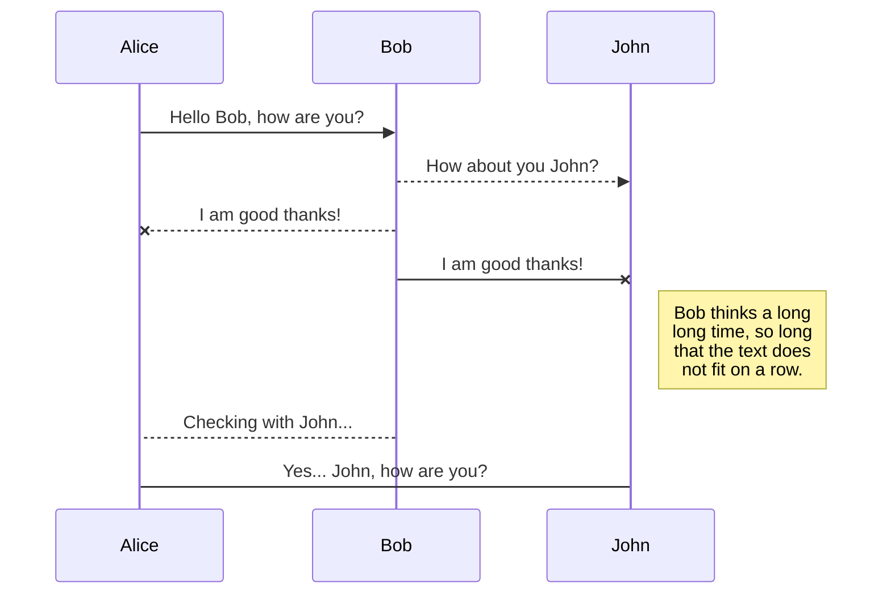
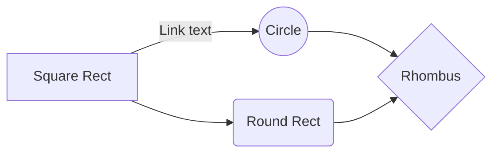

# Debian Setup
My Custom Debian Setup for Debian 13 trixie

## Add essentials
`su -`
**root**$ `usermod -aG sudo kundan-qubitt`
**root**$ `exit`
- A Quick RESTART
```
sudo dpkg --add-architecture i386
sudo apt update && sudo apt install sed
sudo sed -i.bak 's/\bmain\b.*/main contrib non-free/' /etc/apt/sources.list
```
> ### Cross-Verify
> `sudo editor /etc/apt/sources.list`
> check if it contains `main contrib non-free non-free-firmware` for every deb and deb-src lines.
```
sudo apt update && sudo apt upgrade
sudo apt install firmware-linux linux-headers-amd64 linux-headers-$(uname -r) dkms ufw curl wget extrepo ssh vim git build-essential sed libfuse2 v4l2loopback-dkms coreutils command-not-found bash-completion ffmpeg pulseaudio-utils atool libarchive-tools tar
sudo apt install fonts-recommended fonts-freefont-ttf fonts-liberation2 gsfonts fonts-noto fonts-noto-extra fonts-font-awesome ttf-mscorefonts-installer
fc-cache -fv
sudo ufw enable
sudo ufw allow ssh
sudo install -m 0755 -d /etc/apt/keyrings
gsettings set org.gnome.desktop.sound allow-volume-above-100-percent true
sudo apt install gnome-tweaks flatpak gnome-software-plugin-flatpak gnome-browser-connector synaptic pavucontrol timeshift neovim fastfetch
sudo apt install python3-full python3-pip python3-gpg python3-chardet python3-bidi default-jdk
cat <<EOF >> ~/.bashrc

export PATH="\$PATH:/sbin:/usr/sbin"
## ALIAS
alias ll='ls -laF'
alias apt-uu='sudo apt update && sudo apt upgrade'
alias ddebi='sudo apt update && sudo mv ~/Downloads/deb/*.deb /tmp/ && sudo apt install /tmp/*.deb'
## EDITOR
export VISUAL="/usr/bin/nvim"
export EDITOR="\$VISUAL"
EOF
glxinfo | grep "OpenGL"
```

Extras
```
sudo apt install linux-cpupower powertop brightnessctl
```

> ### TTY Setup
> ```
> sudo systemctl disable gdm3
> sudo systemctl set-default multi-user.target
> cat <<EOF >> ~/.bash_profile
> TTY=$(tty)
> case "$TTY" in
> 	/dev/tty5)
> 		if [[ ( ! -z "$XDG_RUNTIME_DIR" ) && -z "$DISPLAY" && -z "$WAYLAND_DISPLAY" ]]; then
> 			echo "Starting \`Hyprland\`"
> 			#exec Hyprland
> 		fi
> 		;;
> 	/dev/tty6)
> 		echo "Starting gdm3"
> 		if [[ ( ! -z "$XDG_RUNTIME_DIR" ) && -z "$DISPLAY" && -z "$WAYLAND_DISPLAY" ]]; then
> 			# echo "Starting \`Gnome Desktop Manager\`"
> 			exec sudo systemctl start gdm3
> 		fi
> 		;;
> esac
> EOF
> ```
> ```sudo visudo```
> add line `kundan-qubitt ALL=(ALL) NOPASSWD: /bin/systemctl start gdm3` in sudoers
> ### Ranger Setup
> ```sudo apt install ranger fontforge transmission-cli caca-utils ffmpegthumbnailer mediainfo bat highlight jq odt2txt lowdown```
> ### eLinks Setup
> ```sudo apt install elinks```
> ### Zsh Setup
> ```sudo apt install zsh```
> ### Fish Setup
> ```sudo apt install fish```

> ### NVIDIA Setup
> ```
> wget https://developer.download.nvidia.com/compute/cuda/repos/debian13/x86_64/cuda-keyring_1.1-1_all.deb
> sudo apt install ./cuda-keyring_1.1-1_all.deb
> sudo apt update
> sudo apt install nvidia-detect nvidia-driver nvidia-settings libnvidia-egl-wayland1 cuda-toolkit nvtop
> ```
> ```sudo nano /etc/default/grub```
> add opt ```nvidia-drm.modeset=1``` to ```GRUB_CMDLINE_LINUX_DEFAULT="quiet"```
> ```sudo update-grub```

> ### Disable Suspension
> get swap UUID from `lsblk -f` and add opt `resumme=UUID=...` to `GRUB_CMDLINE_LINUX_DEFAULT="quiet splash ..."`
> edit /etc/systemd/logind.conf and /etc/systemd/sleep.conf
- A Quick RESTART
```
flatpak remote-add --if-not-exists flathub https://dl.flathub.org/repo/flathub.flatpakrepo
curl -fsS https://dl.brave.com/install.sh | sh
sudo apt install arduino fritzing
flatpak install flathub com.mattjakeman.ExtensionManager com.obsproject.Studio org.kde.okular
```
> ### Unity Installation
> ```
> sudo apt update && sudo apt upgrade
> curl -fsSL https://hub.unity3d.com/linux/keys/public | sudo gpg --dearmor -o /etc/apt/keyrings/unityhub.gpg
> echo "deb [arch=amd64 signed-by=/etc/apt/keyrings/unityhub.gpg] https://hub.unity3d.com/linux/repos/deb stable main" | sudo tee /etc/apt/sources.list.d/unityhub.list
> sudo apt update && sudo apt install unityhub
> ```

> ### KVM Installation
> ```
> sudo apt install qemu-kvm libvirt-daemon-system libvirt-clients bridge-utils virt-manager cpu-checker
> kvm-ok
> sudo usermod -aG libvirt $USER
> sudo usermod -aG kvm $USER
> ...
> ```

> ### Docker Installation
> ```
> # Add Docker's official GPG key:
> sudo apt update
> sudo apt install ca-certificates curl
> sudo curl -fsSL https://download.docker.com/linux/debian/gpg -o /etc/apt/keyrings/docker.asc
> sudo chmod a+r /etc/apt/keyrings/docker.asc
> # Add the repository to Apt sources:
> sudo tee /etc/apt/sources.list.d/docker.sources <<EOF
> Types: deb
> URIs: https://download.docker.com/linux/debian
> Suites: $(. /etc/os-release && echo "$VERSION_CODENAME")
> Components: stable
> Architectures: $(dpkg --print-architecture)
> Signed-By: /etc/apt/keyrings/docker.asc
> EOF
> sudo apt update
> sudo apt remove $(dpkg --get-selections docker.io docker-compose docker-doc podman-docker containerd runc | cut -f1)
> echo \$(. /etc/os-release && echo "$VERSION_CODENAME")
> sudo apt install docker-ce docker-ce-cli containerd.io docker-buildx-plugin docker-compose-plugin
> sudo systemctl status docker
> # install docker.deb
> ```

> ### OneDrive Installation
> ```
> wget -qO - https://download.opensuse.org/repositories/home:/npreining:/debian-ubuntu-onedrive/Debian_13/Release.key | gpg --dearmor | sudo tee /usr/share/keyrings/obs-onedrive.gpg > /dev/null
> echo "deb [arch=$(dpkg --print-architecture) signed-by=/usr/share/keyrings/obs-onedrive.gpg] https://download.opensuse.org/repositories/home:/npreining:/debian-ubuntu-onedrive/Debian_13/ ./" | sudo tee /etc/apt/sources.list.d/onedrive.list
> sudo apt update && sudo apt install onedrive
> ```


> ### NVIDIA Setup
> ```
> sudo apt install nvidia-driver vulkan-tools nvidia-cuda-toolkit nvidia-prime
> sudo reboot
> nvidia-smi
> ```


# 🎮 1. Steam + Proton + DLSS Optimization

## Install Steam + Proton tools

sudo apt update  
sudo apt install steam gamemode mangohud

Enable 32-bit Vulkan (important):

sudo dpkg --add-architecture i386  
sudo apt update  
sudo apt install libvulkan1:i386

----------

## 🔥 Enable Proton (best performance layer)

Inside Steam:

-   Settings → Compatibility
-   Enable:
    -   ✔ “Enable Steam Play for all titles”
    -   ✔ Proton Experimental (or latest Proton-GE)

----------

## 🚀 DLSS support (RTX 3050)

DLSS works automatically in supported games if:

✔ Vulkan or DX12 enabled  
✔ NVIDIA driver is working  
✔ Proton GE used for newer titles

Recommended Proton GE:

-   Install **ProtonUp-Qt**:

flatpak install flathub net.davidotek.pupgui2

Then install latest Proton-GE.

----------

## 🎯 Steam launch options (important)

Use this for ALL games:

gamemoderun mangohud %command%

For NVIDIA offload (hybrid laptops):

__NV_PRIME_RENDER_OFFLOAD=1  __GLX_VENDOR_LIBRARY_NAME=nvidia gamemoderun %command%


# ⚡ 2. FPS Boost Config (RTX 3050 Laptop)

## NVIDIA performance tuning

Create config:

sudo nano /etc/modprobe.d/nvidia-performance.conf

Add:

options nvidia NVreg_UsePageAttributeTable=1  
options nvidia NVreg_EnableGpuFirmware=0  
options nvidia-drm modeset=1

----------

## Enable persistent performance mode

sudo nvidia-smi -pm  1  
sudo nvidia-smi -pl  80

(80W is a good laptop balance — adjust if needed)

----------

## Vulkan + gaming tweaks

sudo apt install mesa-utils vulkan-tools

Force async shader compile (helps stutter):

__GL_THREADED_OPTIMIZATIONS=1

Add to Steam launch options if needed.


# 🔋 3. Battery ↔ Performance Auto Switch (Hybrid GPU)

We’ll create a simple smart switch script.

## Install tools

sudo apt install acpi tlp  
sudo systemctl enable tlp

----------

## Create auto GPU switch script

sudo nano /usr/local/bin/gpu-mode.sh

Paste:

#!/bin/bash  
  
BATTERY_LEVEL=$(cat /sys/class/power_supply/BAT0/capacity)  
ADAPTER=$(cat /sys/class/power_supply/AC/online)  
  
if [ "$ADAPTER"  -eq  1 ]; then  
  # Plugged in → NVIDIA performance  
  sudo prime-select nvidia  
 nvidia-smi -pm  1  
else  
  # On battery → Intel mode  
  sudo prime-select intel  
fi

Make executable:

sudo  chmod  +x /usr/local/bin/gpu-mode.sh

----------

## Auto-run every 2 minutes

crontab -e

Add:

*/2 * * * * /usr/local/bin/gpu-mode.sh


## ⚡ OBS + Gaming performance combo

Run game like:

gamemoderun mangohud %command%

Run OBS normally (Wayland safe)


## Wayland screen capture fix

Install:

sudo apt install xdg-desktop-portal xdg-desktop-portal-gnome

Restart:

reboot

In OBS:

-   Use **PipeWire Screen Capture**


## Enable NVIDIA encoder (NVENC)

Inside OBS:

-   Settings → Output
-   Encoder: **NVENC H.264 (new)**


## Verify NVIDIA CUDA

nvidia-smi  
nvcc --version


To use NVIDIA graphics on Debian 13 (Trixie), you must **enable the non-free repository** and install the proprietary drivers via `apt`, as the default `nouveau` open-source driver does not provide full hardware acceleration.

## Installation Methods

-   **Standard Repository Installation (Recommended):** This method installs the latest stable drivers available in Debian's official repositories (e.g., NVIDIA 550.x series) and handles kernel updates automatically via DKMS.
    
    ```
    # Edit sources.list to include non-free components
    sudo sed -i 's/main/main non-free contrib/g' /etc/apt/sources.list
    
    # Update package lists and install kernel headers (required for Debian 13's kernel 6.12)
    sudo apt update
    sudo apt install linux-headers-$(uname-r) build-essential dkms nvidia-detect
    
    # Install the driver
    sudo apt install nvidia-driver nvidia-kernel-dkms nvidia-smi
    sudo reboot
    ```
    
-   **NVIDIA CUDA Repository (Latest Drivers):** For users needing the absolute latest drivers (e.g., 595.x series for RTX 50/40 series) not yet in Debian repos, the NVIDIA CUDA repository can be added.
    
    ```
    wget https://developer.download.nvidia.com/compute/cuda/repos/debian13/x86_64/cuda-keyring_1.1-1_all.deb
    sudo dpkg -i cuda-keyring_1.1-1_all.deb
    sudo apt update
    sudo apt install cuda-drivers
    ```
    
-   **Manual .run Installation:** Users can download the `.run` installer directly from NVIDIA's website, though this requires manual reinstallation after every kernel update unless DKMS is explicitly enabled during the process.
    

## Key Considerations

-   **Kernel Headers:** Unlike previous versions, Debian 13 with kernel 6.12 **requires explicit installation of `linux-headers-$(uname-r)`** before installing the NVIDIA driver, or DKMS will fail to build the module.
    
-   **Nouveau Blacklisting:** The proprietary installer automatically blacklists the `nouveau` driver, but you may need to manually create `/etc/modprobe.d/blacklist-nouveau.conf` if blacklisting does not occur.
    
-   **Driver Flavors:** Debian 13 supports both **proprietary** (closed-source) and **open** kernel modules; the open modules are recommended for Turing architecture and newer GPUs but may lack features found in the proprietary version.
    
-   **Verification:** Confirm installation by running `nvidia-smi` after reboot, which should display GPU information, driver version, and usage statistics.
    

Debian 13 Feature

Default Driver

Best For

**Repository Driver**

NVIDIA 550.163.x

Current desktops and workstations

**Open Kernel Modules**

`nvidia-kernel-open-dkms`

Turing and newer GPUs (supported option)

**Manual Install**

Latest `.run` file

Users needing specific versions not in repos


# a
# b
# c
With [Handlebars templates](http://handlebarsjs.com/), you have full control over what you export.

## SmartyPants

SmartyPants converts ASCII punctuation characters into "smart" typographic punctuation HTML entities. For example:

|                |ASCII                          |HTML                         |
|----------------|-------------------------------|-----------------------------|
|Single backticks|`'Isn't this fun?'`            |'Isn't this fun?'            |
|Quotes          |`"Isn't this fun?"`            |"Isn't this fun?"            |
|Dashes          |`-- is en-dash, --- is em-dash`|-- is en-dash, --- is em-dash|


## KaTeX

You can render LaTeX mathematical expressions using [KaTeX](https://khan.github.io/KaTeX/):

The *Gamma function* satisfying $\Gamma(n) = (n-1)!\quad\forall n\in\mathbb N$ is via the Euler integral

$$
\Gamma(z) = \int_0^\infty t^{z-1}e^{-t}dt\,.
$$

> You can find more information about **LaTeX** mathematical expressions [here](http://meta.math.stackexchange.com/questions/5020/mathjax-basic-tutorial-and-quick-reference).


## UML diagrams

You can render UML diagrams using [Mermaid](https://mermaidjs.github.io/). For example, this will produce a sequence diagram:



And this will produce a flow chart:




# Welcome to StackEdit!

Hi! I'm your first Markdown file in **StackEdit**. If you want to learn about StackEdit, you can read me. If you want to play with Markdown, you can edit me. Once you have finished with me, you can create new files by opening the **file explorer** on the left corner of the navigation bar.


# Files

StackEdit stores your files in your browser, which means all your files are automatically saved locally and are accessible **offline!**

## Create files and folders

The file explorer is accessible using the button in left corner of the navigation bar. You can create a new file by clicking the **New file** button in the file explorer. You can also create folders by clicking the **New folder** button.

## Switch to another file

All your files and folders are presented as a tree in the file explorer. You can switch from one to another by clicking a file in the tree.

## Rename a file

You can rename the current file by clicking the file name in the navigation bar or by clicking the **Rename** button in the file explorer.

## Delete a file

You can delete the current file by clicking the **Remove** button in the file explorer. The file will be moved into the **Trash** folder and automatically deleted after 7 days of inactivity.

## Export a file

You can export the current file by clicking **Export to disk** in the menu. You can choose to export the file as plain Markdown, as HTML using a Handlebars template or as a PDF.


# Synchronization

Synchronization is one of the biggest features of StackEdit. It enables you to synchronize any file in your workspace with other files stored in your **Google Drive**, your **Dropbox** and your **GitHub** accounts. This allows you to keep writing on other devices, collaborate with people you share the file with, integrate easily into your workflow... The synchronization mechanism takes place every minute in the background, downloading, merging, and uploading file modifications.

There are two types of synchronization and they can complement each other:

- The workspace synchronization will sync all your files, folders and settings automatically. This will allow you to fetch your workspace on any other device.
	> To start syncing your workspace, just sign in with Google in the menu.

- The file synchronization will keep one file of the workspace synced with one or multiple files in **Google Drive**, **Dropbox** or **GitHub**.
	> Before starting to sync files, you must link an account in the **Synchronize** sub-menu.

## Open a file

You can open a file from **Google Drive**, **Dropbox** or **GitHub** by opening the **Synchronize** sub-menu and clicking **Open from**. Once opened in the workspace, any modification in the file will be automatically synced.

## Save a file

You can save any file of the workspace to **Google Drive**, **Dropbox** or **GitHub** by opening the **Synchronize** sub-menu and clicking **Save on**. Even if a file in the workspace is already synced, you can save it to another location. StackEdit can sync one file with multiple locations and accounts.

## Synchronize a file

Once your file is linked to a synchronized location, StackEdit will periodically synchronize it by downloading/uploading any modification. A merge will be performed if necessary and conflicts will be resolved.

If you just have modified your file and you want to force syncing, click the **Synchronize now** button in the navigation bar.

> **Note:** The **Synchronize now** button is disabled if you have no file to synchronize.

## Manage file synchronization

Since one file can be synced with multiple locations, you can list and manage synchronized locations by clicking **File synchronization** in the **Synchronize** sub-menu. This allows you to list and remove synchronized locations that are linked to your file.


# Publication

Publishing in StackEdit makes it simple for you to publish online your files. Once you're happy with a file, you can publish it to different hosting platforms like **Blogger**, **Dropbox**, **Gist**, **GitHub**, **Google Drive**, **WordPress** and **Zendesk**. With [Handlebars templates](http://handlebarsjs.com/), you have full control over what you export.

> Before starting to publish, you must link an account in the **Publish** sub-menu.

## Publish a File

You can publish your file by opening the **Publish** sub-menu and by clicking **Publish to**. For some locations, you can choose between the following formats:

- Markdown: publish the Markdown text on a website that can interpret it (**GitHub** for instance),
- HTML: publish the file converted to HTML via a Handlebars template (on a blog for example).

## Update a publication

After publishing, StackEdit keeps your file linked to that publication which makes it easy for you to re-publish it. Once you have modified your file and you want to update your publication, click on the **Publish now** button in the navigation bar.

> **Note:** The **Publish now** button is disabled if your file has not been published yet.

## Manage file publication

Since one file can be published to multiple locations, you can list and manage publish locations by clicking **File publication** in the **Publish** sub-menu. This allows you to list and remove publication locations that are linked to your file.


# Markdown extensions

StackEdit extends the standard Markdown syntax by adding extra **Markdown extensions**, providing you with some nice features.

> **ProTip:** You can disable any **Markdown extension** in the **File properties** dialog.


## SmartyPants

SmartyPants converts ASCII punctuation characters into "smart" typographic punctuation HTML entities. For example:

|                |ASCII                          |HTML                         |
|----------------|-------------------------------|-----------------------------|
|Single backticks|`'Isn't this fun?'`            |'Isn't this fun?'            |
|Quotes          |`"Isn't this fun?"`            |"Isn't this fun?"            |
|Dashes          |`-- is en-dash, --- is em-dash`|-- is en-dash, --- is em-dash|


## KaTeX

You can render LaTeX mathematical expressions using [KaTeX](https://khan.github.io/KaTeX/):

The *Gamma function* satisfying $\Gamma(n) = (n-1)!\quad\forall n\in\mathbb N$ is via the Euler integral

$$
\Gamma(z) = \int_0^\infty t^{z-1}e^{-t}dt\,.
$$

> You can find more information about **LaTeX** mathematical expressions [here](http://meta.math.stackexchange.com/questions/5020/mathjax-basic-tutorial-and-quick-reference).


## UML diagrams

You can render UML diagrams using [Mermaid](https://mermaidjs.github.io/). For example, this will produce a sequence diagram:


And this will produce a flow chart:


